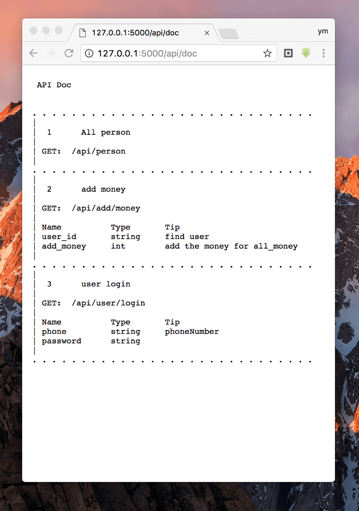

# TinyGoAPIDoc

# One line use
```
APIDocAddHandleFun(apiPerson, APIs{Info{title: "user get new money", url: "/api/person"}, nil})
```

# Or only use doc

### create new handle
```
http.HandleFunc("/api/person", apiPerson)
```

### add this handle doc (only doc)
```
var tags = []APITag{
		{Name: "user_id", Type: "string", Tip: "user id, find user"},
		{Name: "age", Type: "int", Tip: "user age, wait sort age"},
		{Name: "add_money", Type: "double", Tip: "user add new money"},}
APIDocAddOnes(APIs{Info{title: "user get new money", url: "/api/person"}, tags})
```

# sample code 
```
package main
func apiPerson(w http.ResponseWriter, r *http.Request) {
	fmt.Fprintf(w, "{name: redDog, age:20}")
}

func apiAddMoney(w http.ResponseWriter, r *http.Request) {
	fmt.Fprintf(w, "{all_money:2450}")
}

func apiUserLogin(w http.ResponseWriter, r *http.Request) {
	fmt.Fprintf(w, "{login:succes, user_id:3213819283ANF2C}")
}

func main() {
	APIDocAddHandleFun(apiPerson, APIs{Info{title: "All person", url: "/api/person"}, nil})
	APIDocAddHandleFun(apiAddMoney, APIs{Info{title: "add money", url: "/api/add/money"}, []APITag{
		{Name: "user_id", Type: "string", Tip: "find user"},
		{Name: "add_money", Type: "int", Tip: "add the money for all_money key!"},
	}})
	APIDocAddHandleFun(apiUserLogin, APIs{Info{title: "user login", url: "/api/user/login"}, []APITag{
		{Name: "phone", Type: "string", Tip: "phoneNumber"},
		{Name: "password", Type: "string", Tip: ""},
	}})
	http.ListenAndServe(":5000", nil)
	fmt.Printf("listen localhost:5000")
}
```

### Open Url Look API Doc
```
http://127.0.0.1:5000/api/doc
```

### Open Url Look data
```
http://127.0.0.1:5000/api/person
http://127.0.0.1:5000/api/add/money
http://127.0.0.1:5000/api/user/login
```